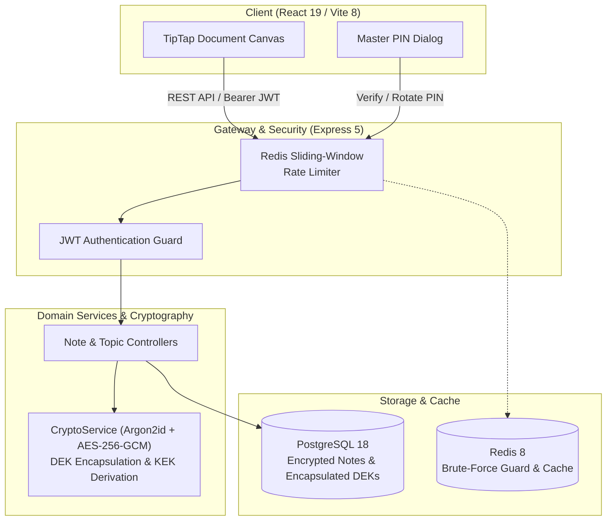

<div align="center">

# NoteVault

### Secure Personal Knowledge Base with Enveloped Note Encryption

[](https://www.typescriptlang.org)
[](https://expressjs.com)
[](https://react.dev)
[](https://vitejs.dev)
[](https://bun.sh)
[](https://www.postgresql.org)
[](https://redis.io)
[](https://note-vault-dusky.vercel.app)

**Live Demo:** [https://note-vault-dusky.vercel.app](https://note-vault-dusky.vercel.app)

</div>

---

## Overview

NoteVault là hệ thống ghi chú bảo mật cá nhân theo phong cách Notion. Ứng dụng kết hợp trình soạn thảo TipTap (JSON AST) với mô hình Enveloped Encryption: mỗi ghi chú khóa bằng một DEK riêng biệt (AES-256-GCM), DEK được bọc bằng KEK phái sinh từ Master PIN (Argon2id), cho phép đổi Master PIN tức thì mà không cần giải mã lại nội dung ghi chú.

---

## Thành viên nhóm thực hiện

| STT | Họ và tên              |     MSSV     | Vai trò / Phụ trách                          |
| :-: | :--------------------- | :----------: | :------------------------------------------- |
|  1  | Đặng Duy Lam           | `0306241125` | Trưởng nhóm, Fullstack & Kiến trúc hệ thống  |
|  2  | Trần Văn Ngọc          | `0306241131` | Frontend UI/UX, TipTap Canvas & State        |
|  3  | Nguyễn Quốc Đương      | `0306241102` | Backend API, Enveloped Encryption & Database |
|  4  | Nguyễn Trần Ngọc Duyên | `0306241187` | Testing, Quality Gates & Tài liệu dự án      |

---

### System Architecture & Data Flow



---

## Services & Ports

| Service             | Stack                           |  Port   | Mô tả                                         |
| :------------------ | :------------------------------ | :-----: | :-------------------------------------------- |
| **REST API Server** | Express 5 + Prisma 8            | `:5000` | Xác thực JWT, Enveloped Crypto, REST APIs     |
| **Web Dashboard**   | React 19 + Vite 8 + Tailwind v4 | `:5173` | Notion canvas, TipTap editor, PIN modal       |
| **PostgreSQL**      | PostgreSQL 18 (Docker)          | `:5432` | Lưu trữ dữ liệu và DEK đã mã hóa              |
| **Redis**           | Redis 8 (Docker)                | `:6379` | Sliding-window rate limiter chống brute-force |

---

## Yêu cầu môi trường

Hệ thống yêu cầu các phiên bản môi trường và runtime tối thiểu như sau:

| Công cụ / Dịch vụ           | Phiên bản khuyến nghị           | Mục đích sử dụng                                               |
| :-------------------------- | :------------------------------ | :------------------------------------------------------------- |
| **Bun**                     | `^1.4.0` (khuyên dùng `1.4.2+`) | Package manager & runtime thực thi script monorepo             |
| **Node.js**                 | `>= 22.0.0` (tùy chọn)          | Node runtime (nếu chạy bản build server `node dist/server.js`) |
| **PostgreSQL**              | `18.x` (Alpine qua Docker)      | Cơ sở dữ liệu chính, lưu trữ ciphertext và DEK bọc             |
| **Redis**                   | `8.x` (Alpine qua Docker)       | Cache bộ nhớ và sliding-window rate limiting                   |
| **Docker & Docker Compose** | Docker v26+ / Compose v2.20+    | Quản lý container cho PostgreSQL 18 và Redis 8                 |

---

## Quickstart

### 1. Khởi động hạ tầng Docker

```bash
docker compose -f backend/docker-compose.yml up -d
```

### 2. Thiết lập biến môi trường cho Backend

> [!IMPORTANT]
> **Bắt buộc có file `backend/.env` để chạy backend.** Server sẽ không thể kết nối Database/Redis hoặc ký token JWT nếu thiếu cấu hình này.

Tạo file `.env` từ file mẫu:

```bash
cp backend/.env.example backend/.env
```

_(Kiểm tra các biến cấu hình kết nối DB, Redis và các khóa bảo mật `JWT_SECRET`, `PRIVATE_NOTE_MASTER_KEY` theo nhu cầu)._

### 3. Cài đặt & đồng bộ Types

```bash
bun install
bun run sync:types
```

### 4. Chạy môi trường phát triển

```bash
bun run dev # Chạy backend và frontend cùng lúc
bun run dev:frontend # Chỉ chạy frontend
bun run dev:backend # Chỉ chạy backend
```

- Web UI (Production): [https://note-vault-dusky.vercel.app](https://note-vault-dusky.vercel.app)
- Web UI (Local): [http://localhost:5173](http://localhost:5173)
- API (Local): [http://localhost:5000](http://localhost:5000)

---

## Quality Gates

```bash
bun run check-types  # Kiểm tra toàn bộ TypeScript
bun run lint         # Lint code bằng Oxlint
```

---

## Cấu trúc dự án

```text
.
├── backend/          # REST API Server (Express 5, Prisma 8, Argon2id)
├── frontend/         # Web Client (React 19, TipTap, Tailwind v4, Zustand)
└── docs/             # ADRs (0001 - 0003) & 11 Operational Standards
```
