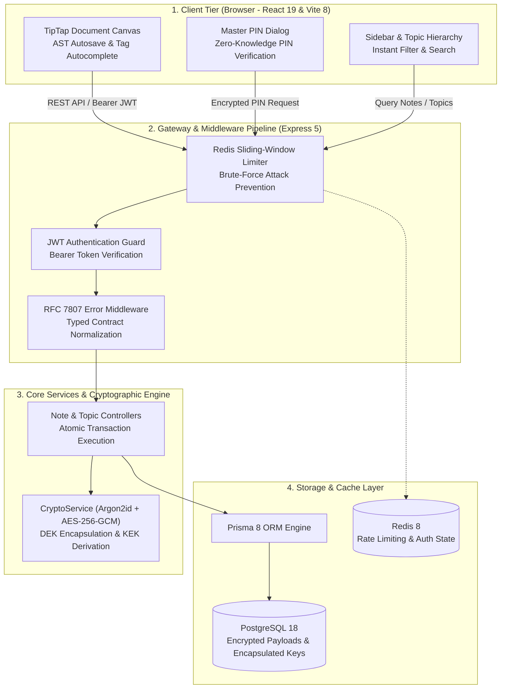

<div align="center">

# NoteVault Platform

### Zero-Knowledge Secure Personal Knowledge Base & Enveloped Note Encryption System

[](https://www.typescriptlang.org)
[](https://expressjs.com)
[](https://react.dev)
[](https://vitejs.dev)
[](https://tailwindcss.com)
[](https://bun.sh)
[](https://www.postgresql.org)
[](https://redis.io)
[](https://www.prisma.io)
[](https://oxc.rs)

</div>

---

## Overview

**NoteVault** is an enterprise-grade, high-security personal knowledge and document workspace engineered with end-to-end cryptographic protection. Inspired by minimalist document canvases like Notion, NoteVault pairs an extensible TipTap rich-text editor with a Zero-Knowledge **Enveloped Encryption (Key Encapsulation / KEK)** model. Confidential documents, credentials, and sensitive notes are sealed cryptographically at rest with Argon2id and AES-256-GCM, allowing instantaneous Master PIN rotations without rewrites of underlying note contents.

---

## Live Services & Port Matrix

| Service                   | Technology                      | Local Port | Context Path     | Description                                                                   |
| :------------------------ | :------------------------------ | :--------: | :--------------- | :---------------------------------------------------------------------------- |
| **REST API Server**       | Express 5 + Prisma 8 + Argon2   |  `:5000`   | `/api/v1`        | Core authentication, enveloped crypto, notes/topics CRUD, Redis rate limiting |
| **Web Dashboard**         | Vite 8 + React 19 + Tailwind v4 |  `:5173`   | `/`              | Notion-style canvas, TipTap editor, master PIN lock modals, tag taxonomy      |
| **PostgreSQL Database**   | PostgreSQL 18 (Docker)          |  `:5432`   | `note_vault_db`  | Relational document store, encrypted payloads, and encapsulated DEKs          |
| **Redis Cache & Limiter** | Redis 8 (Docker)                |  `:6379`   | `localhost:6379` | Sliding-window auth rate limiting and session security safeguards             |

---

## Architecture Overview

The repository is structured as a typed monorepo split into decoupled runtime environments with shared schema contracts:

```text
.
├── backend/                  # Node.js Express 5 REST API Server
│   ├── src/controllers/      # HTTP request controllers (Auth, Note, Topic)
│   ├── src/services/         # Enveloped crypto & Argon2id key encapsulation
│   ├── src/prisma/           # Prisma 8 schema contract & type generation
│   ├── src/middlewares/      # JWT auth, Redis rate limiting, error middleware
│   ├── Dockerfile            # Multi-stage production build (Debian node:20-slim)
│   └── docker-compose.yml    # PostgreSQL 18 & Redis 8 services
│
├── frontend/                 # Vite 8 + React 19 Client SPA
│   ├── src/components/       # Editor canvas, sidebar navigation, PIN modals
│   ├── src/stores/           # Zustand state management (Auth, Note, UI theme)
│   ├── src/services/         # Axios API clients & contract DTO bindings
│   └── src/types/            # Synchronized Prisma contract typings
│
├── docs/                     # Engineering specifications & decisions
│   ├── adr/                  # Architectural Decision Records (ADR 0001 - 0003)
│   ├── standards/            # 11 Operational Engineering Standards
│   └── dataflow/             # 6 End-to-End System Dataflow specifications
│
├── package.json              # Monorepo task orchestration & Husky pre-commit gates
└── bun.lock                  # Lockfile for Bun workspace
```

### System Data Flow Architecture



---

## Core Security & Engineering Highlights

- **Enveloped Encryption (ADR 0003)**:
  - Each note generates an ephemeral 256-bit **Data Encryption Key (DEK)** for AES-256-GCM content encryption.
  - The user's Master PIN derives a **Key Encryption Key (KEK)** via Argon2id (`vaultKey`) to encapsulate the DEK into `encrypted_key`.
  - **Sub-second PIN rotation**: Changing the Master PIN un-encapsulates and re-wraps DEKs in an atomic database transaction without ever decrypting or rewriting heavy document bodies.
- **TipTap JSON AST Autosave**: Documents persist structured JSON AST content rather than raw HTML, ensuring clean bidirectional diffing and template expansion.
- **High-Fidelity UI Philosophy**: Notion-style minimalist canvas with light/dark theme adaptation, keyboard shortcuts (`Cmd/Ctrl+K`), custom PIN keypad, and tag taxonomy.
- **Standardized Monorepo Tooling**: Bun runtime, type-aware Oxlint linter, Husky pre-commit hooks, and synchronous Prisma DTO emission (`bun run sync:types`).

---

## Quickstart

### Prerequisites

- **Bun** `v1.4+`
- **Docker & Docker Compose** (PostgreSQL 18, Redis 8)
- **Node.js** `20+` (if running node-specific scripts outside Bun)

### Setup & Run

```bash
# 1. Install workspace dependencies
bun install

# 2. Spin up PostgreSQL and Redis
bun run --cwd backend docker-compose up -d
# or: cd backend && docker compose up -d

# 3. Synchronize database contracts & generate client
bun run sync:types

# 4. Run database migrations
bun run --cwd backend db:migrate

# 5. Start fullstack development environment
bun run dev
```

- **Frontend App**: [http://localhost:5173](http://localhost:5173)
- **Backend REST API**: [http://localhost:5000](http://localhost:5000)

---

## Verification & Code Quality Gates

The repository strictly enforces automated verification standards before every commit:

```bash
# Run type checks across backend and frontend
bun run check-types

# Run ultra-fast linting with Oxlint
bun run lint

# Synchronize backend Prisma contracts to frontend types
bun run sync:types
```

---

## Engineering Standards & Documentation

Comprehensive operational documentation and architectural design records are maintained in `/docs`:

- **Architectural Decision Records**:
  - [ADR 0001: Default Encryption, JSON AST, and Prisma Contract](docs/adr/0001-default-encryption-json-ast-and-prisma-contract.md)
  - [ADR 0002: Secure Masked Blocks and Credential Templates](docs/adr/0002-secure-masked-blocks-and-credential-templates.md)
  - [ADR 0003: Enveloped Encryption and Master PIN Rotation](docs/adr/0003-enveloped-encryption-and-master-pin-rotation.md)
- **Operational Standards**:
  - [API Design & Error Handling](docs/standards/api-design-and-error-handling.md)
  - [Security & Cryptography](docs/standards/security-and-cryptography.md)
  - [Concurrency & Locking](docs/standards/concurrency-and-locking.md)
  - [Database & Migrations](docs/standards/database-and-migrations.md)
  - [UI & Visual Design Philosophy](docs/standards/ui-design-philosophy.md)
  - [Git Flow & PR Matrix](docs/standards/git-flow-and-pr-matrix.md)
