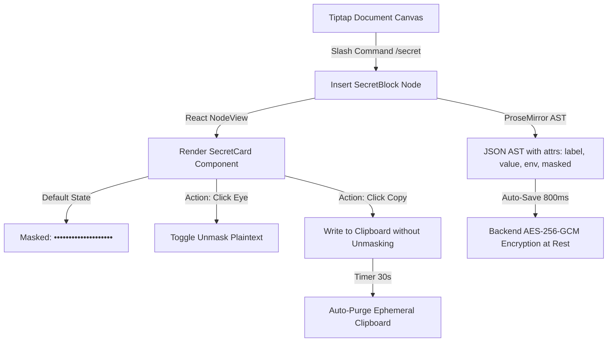

# ADR-0002: Secure Masked Blocks, Credential Field Components, and Auto-Clear Clipboard Architecture

- **Status**: PROPOSED
- **Date**: 2026-09-29
- **Deciders**: @team

---

## 1. Context & Problem Statement

Developers and technical knowledge workers frequently store operational secrets—such as API keys, environment variables, database connection strings, webhook secrets, and account tokens—within their documentation and engineering notes.

In NoteVault's current implementation, while entire notes can be locked behind a Master PIN (`is_locked: true`), once a note is decrypted, **all sensitive tokens are rendered as raw plaintext on the document canvas**. This introduces critical security and usability vulnerabilities:

1. **Shoulder Surfing & Screen-Share Leaks**: Working in coffee shops, open offices, or during live screen-sharing (Zoom, Google Meet, Discord) exposes sensitive tokens directly to onlookers and screen recordings.
2. **Copy Friction & Accidental Mutation**: Selecting lengthy cryptographic tokens (e.g. `sk_live_...`, 256-bit hex hashes) manually using cursor selection is prone to missing characters or accidentally typing over and corrupting the secret.
3. **Clipboard Residue**: Plaintext secrets copied to the system clipboard remain indefinitely in OS clipboard history tools (Raycast, Alfred, Windows Clipboard History), creating a persistent attack surface.
4. **Lack of Structured Credential Layouts**: Users format credentials using ad-hoc bullet points or code blocks without clear field semantics (Label, Environment, Key, Value).

---

## 2. Decision Drivers

- **Document-First Canvas Integrity**: Secrets MUST remain first-class citizens of the document flow rather than isolated into an external, disconnected password-manager view.
- **Zero Shoulder-Surfing by Default**: Secret values MUST be masked by default (`••••••••••••••••••••`) upon note load and render.
- **Frictionless Developer Workflow**: Copying a secret must require exactly one click, without requiring the user to unmask and manually highlight the token.
- **Ephemeral Clipboard Hygiene**: Copied secrets MUST be cleared automatically from the client clipboard after a deterministic timeout (30 seconds) to prevent clipboard persistence.
- **Extensible JSON AST**: Secret blocks MUST be serialized natively within Tiptap / ProseMirror JSON AST (`editor.getJSON()`), fully compatible with NoteVault's default AES-256-GCM encryption at rest.

---

## 3. Considered Options

### Option A: Separate Standalone Password Manager Module

- Build dedicated database tables (`credentials`, `secret_fields`) with separate sidebar views and specialized CRUD forms (similar to Bitwarden / 1Password).
- **Pros**: Clear mental model separation.
- **Cons**: Severe product fragmentation. Forces developers out of their documentation flow into a separate tab; breaks the core Notion-style unified canvas experience; requires new migrations, routes, and controllers.

### Option B: Markdown Obfuscation Hack (HTML `<details>` or CSS filters)

- Wrap secrets in collapsible `<details>` tags or blur filter CSS (`blur-sm hover:blur-none`).
- **Pros**: Requires no custom ProseMirror node schemas.
- **Cons**: Fragile AST serialization; easily breaks rich-text editing; plaintext remains accessible in DOM text nodes; no automated clipboard clearing or structured credential metadata.

### Option C: Custom Tiptap Node Extension (`SecretBlock` / `SecretField`) with Ephemeral Clipboard (Chosen)

- Model credentials as a structured ProseMirror node with React NodeView rendering.
- Values are masked by default, unmasked on demand, support single-click copy without unmasking, and automatically purge the system clipboard after 30 seconds.
- **Pros**: Seamless integration with the document-first canvas; 100% compatible with existing AES-256-GCM encryption at rest; clean JSON AST representation; zero database schema changes.
- **Cons**: Requires building a custom Tiptap Node extension and React NodeView wrapper.

---

## 4. Decision Outcome

We adopt **Option C**.



### 4.1. ProseMirror Node Specification (`SecretBlock`)

The custom node is defined as a block element within Tiptap:

```ts
// frontend/src/components/editor/extensions/SecretBlock.ts
export interface SecretBlockAttrs {
  label: string;
  value: string;
  environment?: "production" | "staging" | "development" | "default";
  service?: string; // e.g. "stripe", "openai", "aws", "database"
}
```

**JSON AST Serialization Example:**

```json
{
  "type": "secretBlock",
  "attrs": {
    "label": "Stripe Live Secret Key",
    "value": "sk_live_51Mz0...99xQ",
    "environment": "production",
    "service": "stripe"
  }
}
```

### 4.2. UI & Interaction Specification (`SecretBlockView.tsx`)

The React NodeView renders an inline credential chip/card:

1. **Header & Metadata**:
   - Service / Key icon (`KeyRound` from Lucide, `size-3.5`).
   - Label: `text-[13px] font-medium text-foreground`.
   - Environment Badge: Minimalist pill (`Production` = `border-destructive/30 text-destructive`, `Staging` = `border-amber-500/30 text-amber-500`, `Development` = `border-muted-foreground/30 text-muted-foreground`).
2. **Secret Value Area**:
   - Masked state: Monospace dots `••••••••••••••••••••••••`.
   - Unmasked state: Monospace raw text `font-mono text-xs selection:bg-muted`.
3. **Actions**:
   - **Toggle Visibility (`Eye` / `EyeOff`)**: Toggles local component visibility state without modifying the saved document AST.
   - **Quick Copy (`Copy` / `Check`)**: Copies `attrs.value` immediately into the clipboard without requiring the user to expose the secret on screen.
   - **Ephemeral Timer**: Registers a 30-second purge task.

### 4.3. Ephemeral Clipboard Purge Architecture

```ts
// Ephemeral clipboard utility
const clipboardTimers = new Map<string, number>();

export async function copySecretWithAutoClear(
  secret: string,
  timeoutMs: number = 30000,
): Promise<void> {
  if (!navigator.clipboard?.writeText) return;

  await navigator.clipboard.writeText(secret);

  // Clear any existing timer for this session
  if (clipboardTimers.has("ephemeral")) {
    clearTimeout(clipboardTimers.get("ephemeral"));
  }

  const timerId = window.setTimeout(async () => {
    try {
      const current = await navigator.clipboard.readText();
      // Only clear if the user hasn't copied something else in the meantime
      if (current === secret) {
        await navigator.clipboard.writeText("");
      }
    } catch {
      // Browser permission / focus loss handled gracefully
    } finally {
      clipboardTimers.delete("ephemeral");
    }
  }, timeoutMs);

  clipboardTimers.set("ephemeral", timerId);
}
```

### 4.4. Credential Templates & Slash Command

Users can trigger creation via:

1. **Slash Command**: Typing `/secret` or `/key` opens the quick insertion prompt.
2. **Template Snippets**:
   - **API Key Preset**: Service Name, API Key, Secret Token.
   - **Database Connection Preset**: Host, Port, Database, User, Password.
   - **SSH & Server Preset**: Hostname, Username, Port, Private Key / Passphrase.

---

## 5. Security & Privacy Trade-Offs

| Consideration                 | Design Stance                                                                                                                                                                               |
| :---------------------------- | :------------------------------------------------------------------------------------------------------------------------------------------------------------------------------------------ |
| **Server-Side Knowledge**     | Secrets are encrypted at rest with the note's AES-256-GCM key (standard user key or Argon2id Master PIN key). Server cannot read tokens when note is PIN-locked.                            |
| **Client Memory**             | Once a note is opened, secret values reside in JavaScript heap memory inside the Tiptap document state. Locking the note triggers an immediate in-memory state purge (`content: null`).     |
| **DOM Inspection**            | When masked, the secret value is NOT written into the DOM text node (only dots `••••` are rendered in the DOM). The raw value only enters DOM nodes when explicitly unmasked by the user.   |
| **Financial / Payment Cards** | NoteVault explicitly scopes this feature to **Developer API keys, passwords, server secrets, and recovery seeds**. Full PCI-DSS compliant credit card vaulting is out-of-scope for Phase 1. |

---

## 6. Implementation Phasing

- **Phase 1 (Extension & View)**:
  - Implement `SecretBlock` Tiptap Node extension.
  - Implement `SecretBlockView.tsx` with toggle mask, single-click copy, and environment badges.
  - Integrate `copySecretWithAutoClear` utility.
- **Phase 2 (Templates & Slash Commands)**:
  - Add `/secret` and `/api` suggestions to Tiptap suggestion menu.
  - Provide preset template generator for API keys and database credentials.
