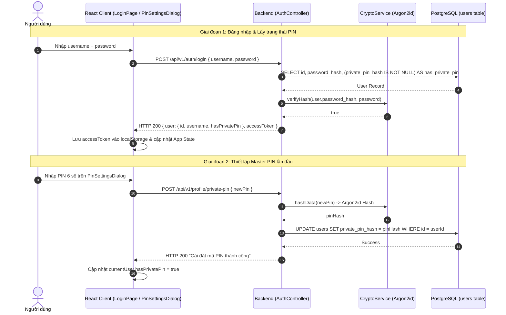

# Dataflow 01: Authentication Session & Master PIN Setup

## 1. Overview & Architectural Intent

Quy trình xác thực người dùng, cấp phát phiên làm việc JWT và thiết lập mã **Master PIN** bí mật để bảo vệ các ghi chú riêng tư.

- **Mật khẩu tài khoản**: Được băm bằng thuật toán `Argon2id` trước khi lưu vào `users.password_hash`.
- **Master PIN**: Mã bí mật 6 số dùng để dẫn xuất khóa giải mã vault (`deriveVaultKey`), được băm bằng `Argon2id` lưu tại `users.private_pin_hash`.
- **Session State**: JWT lưu trong Client `localStorage` và gửi qua header `Authorization: Bearer <token>`.

---

## 2. Sequence Diagram

---

## 3. Data Transformation & Contracts

| Bước  | Thực thể       | Dữ liệu đầu vào (Input)       | Xử lý biến đổi                                    | Kết quả lưu trữ / Trả về                   |
| :---- | :------------- | :---------------------------- | :------------------------------------------------ | :----------------------------------------- |
| **1** | Mật khẩu Login | `password: "secretP@ss123"`   | `Argon2id.verify()` đối chiếu với `password_hash` | Token `JWT` hạn 24h kèm cờ `hasPrivatePin` |
| **2** | Master PIN     | `newPin: "123456"` (6 chữ số) | `Argon2id.hash(newPin)` sinh muối ngẫu nhiên      | `users.private_pin_hash` trong PostgreSQL  |

---

## 4. Defense-in-Depth & Error Edge Cases

1. **Brute-force Throttling**: API `/auth/login` và `/profile/private-pin` áp dụng Rate Limiter nghiêm ngặt (tối đa 5 lần thử / phút).
2. **Ký tự hợp lệ**: Zod Schema `setPrivatePinSchema` chặn đứng mọi chuỗi không đúng regex `/^\d{6}$/`.
3. **Không lưu trữ mã PIN thô**: Tuyệt đối không lưu plaintext PIN trong Database hay Redis.
