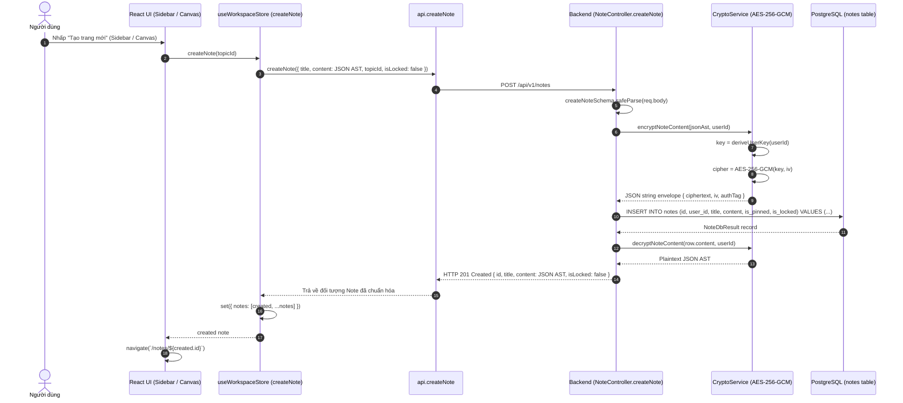

# Dataflow 02: Note Creation & Default Encryption at Rest

## 1. Overview & Architectural Intent

Mọi ghi chú được tạo trong NoteVault đều được **mặc định mã hóa ở tầng lưu trữ (Encryption at Rest by Default)** bằng chuẩn mật mã học `AES-256-GCM`:

- **Định dạng tài liệu**: Bắt đầu bằng cấu trúc rỗng chuẩn ProseMirror JSON AST:
  `{"type":"doc","content":[{"type":"paragraph"}]}`.
- **Khóa dẫn xuất cơ sở (User Key)**: Dẫn xuất từ `userId` kết hợp muối hệ thống tĩnh thông qua hàm băm an toàn `deriveUserKey(userId)`.
- **Gói Ciphertext**: Gồm 3 phần bất khả xâm phạm: `ciphertext` (Base64), `iv` (16 bytes hex), `authTag` (16 bytes hex).

---

## 2. Sequence Diagram



---

## 3. Data Transformation & Contracts

```
[Plaintext JSON AST]
{"type":"doc","content":[{"type":"paragraph"}]}
         │
         ▼ (CryptoService.encryptPayload - AES-256-GCM)
[Database Encrypted Storage - Column notes.content]
{
  "ciphertext": "mB9XQ+7vK...==",
  "iv": "3f42b918a0021c...",
  "authTag": "9c12b7a9f..."
}
```

| Trường dữ liệu | Giá trị khi gửi lên        | Giá trị lưu trong PostgreSQL          | Giá trị trả về Client              |
| :------------- | :------------------------- | :------------------------------------ | :--------------------------------- |
| `title`        | `"Trang chưa có tiêu đề"`  | `"Trang chưa có tiêu đề"` (Plaintext) | `"Trang chưa có tiêu đề"`          |
| `content`      | Chuỗi ProseMirror JSON AST | Gói JSON Ciphertext AES-256-GCM       | Chuỗi JSON AST sẵn sàng cho Tiptap |
| `is_locked`    | `false`                    | `false`                               | `false`                            |
| `tags`         | `[]`                       | `ARRAY[]::text[]` (Postgres native)   | `[]`                               |

---

## 4. Defense-in-Depth & Error Edge Cases

1. **Zero Plaintext Leakage**: Kể cả khi kẻ tấn công dump toàn bộ bảng `notes` trong database, cột `content` chỉ chứa chuỗi ciphertext vô nghĩa.
2. **Khởi tạo IV độc lập**: Mỗi thao tác mã hóa đều sinh ngẫu nhiên 16 bytes `crypto.randomBytes(16)`, đảm bảo 2 ghi chú có cùng nội dung sẽ sinh ra 2 ciphertext hoàn toàn khác biệt.
3. **Tính toàn vẹn (Integrity Check)**: Sử dụng `authTag` của AES GCM giúp phát hiện ngay lập tức bất kỳ sự giả mạo (tampering) dữ liệu nào trong database.
