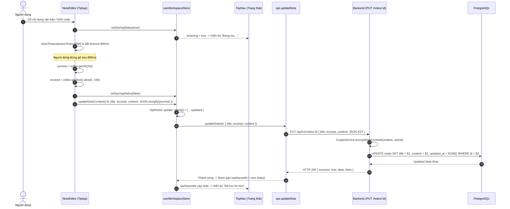

# Dataflow 03: Tiptap Editor Debounced Auto-Save & JSON AST Sync

## 1. Overview & Architectural Intent

Quy trình tự động lưu (Auto-save) mượt mà không làm gián đoạn trải nghiệm người dùng, sử dụng cơ chế **Debounce 800ms** để chuyển đổi DOM của trình soạn thảo thành cấu trúc **ProseMirror JSON AST** và đồng bộ lên server.

- **Không dùng HTML thô**: `editor.getJSON()` thay thế hoàn toàn `.getHTML()` để loại bỏ nguy cơ XSS và tương thích với block models.
- **Tiêu đề & Trích đoạn**: Tự động sinh `excerpt` từ 160 ký tự đầu tiên của văn bản thô (`editor.getText().slice(0, 160)`).
- **Phản hồi giao diện**: Hiển thị trạng thái "Đang lưu..." / "Đã lưu" kín đáo trên thanh `TopNav`.

---

## 2. Sequence Diagram



---

## 3. Data Transformation & AST Payload

```json
{
  "type": "doc",
  "content": [
    {
      "type": "heading",
      "attrs": { "level": 1 },
      "content": [{ "type": "text", "text": "Kiến trúc Zero-Knowledge" }]
    },
    {
      "type": "paragraph",
      "content": [
        { "type": "text", "text": "Hệ thống mã hóa mặc định với " },
        {
          "type": "text",
          "marks": [{ "type": "bold" }],
          "text": "AES-256-GCM"
        },
        { "type": "text", "text": "." }
      ]
    },
    {
      "type": "codeBlock",
      "attrs": { "language": "typescript" },
      "content": [
        { "type": "text", "text": "const key = deriveVaultKey(userId, pin);" }
      ]
    }
  ]
}
```

---

## 4. Defense-in-Depth & Error Edge Cases

1. **XSS Mitigation**: Cây cú pháp JSON AST chỉ chứa các node ngữ nghĩa (`heading`, `paragraph`, `codeBlock`). Bất kỳ thẻ script độc hại nào chèn vào cũng bị xem là text thuần (`type: "text"`), không bao giờ được thực thi trong DOM.
2. **Race Condition Prevention**: Hủy bỏ timeout `clearTimeout(saveTimeoutRef.current)` trong `useEffect` cleanup khi người dùng chuyển sang note khác trước khi hết 800ms.
3. **Optimistic Excerpt Sync**: Trích đoạn `excerpt` cập nhật tức thì trên danh sách thanh bên mà không cần tải lại toàn bộ ghi chú.
