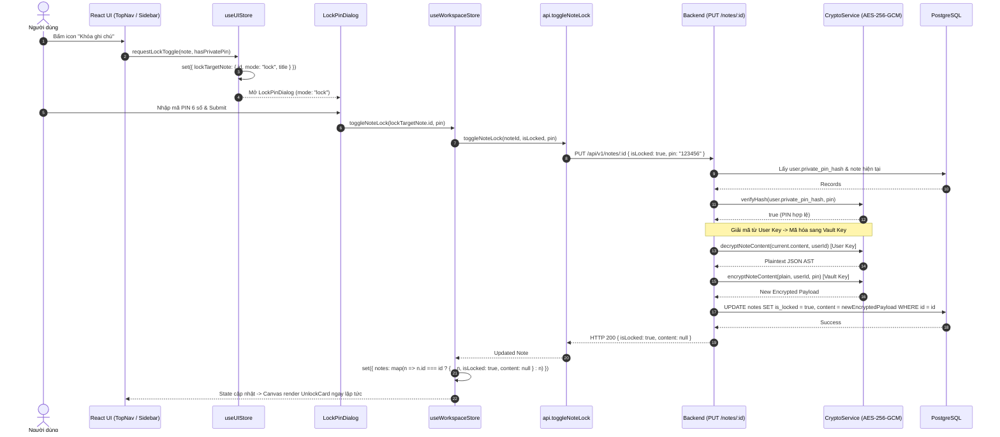

# Dataflow 04: Note Locking & Vault Key Re-Encryption

## 1. Overview & Architectural Intent

Quy trình biến đổi một ghi chú tiêu chuẩn thành **Ghi chú riêng tư có bảo vệ bằng mã PIN (Vault Note)**:

- **Xác thực trước khi Khóa**: Yêu cầu người dùng nhập mã Master PIN 6 số trên `LockPinDialog`.
- **Mã hóa lại thực sự (Genuine Re-encryption)**: Backend giải mã nội dung từ `userKey`, sau đó mã hóa lại bằng `vaultKey = deriveVaultKey(userId, pin)`.
- **Xóa sạch bộ nhớ RAM phía Client**: Ngay khi khóa thành công, Client gán `content: null` để ngăn chặn lộ dữ liệu qua F12 DevTools và kích hoạt ngay màn hình `UnlockCard`.

---

## 2. Sequence Diagram



---

## 3. Data Transformation & Encryption Layer Cutover

```
[Trước khi Khóa - Standard Note]
Ciphertext mã hóa bởi: deriveUserKey(userId)
PostgreSQL: is_locked = false

         │
         ▼  PUT /api/v1/notes/:id { isLocked: true, pin: "123456" }
         │  1. Giải mã bằng deriveUserKey(userId)
         │  2. Mã hóa lại bằng deriveVaultKey(userId, pin)
         │
[Sau khi Khóa - Locked Vault Note]
Ciphertext mã hóa bởi: deriveVaultKey(userId, "123456")
PostgreSQL: is_locked = true
Client RAM: content = null (Purged)
```

---

## 4. Defense-in-Depth & Error Edge Cases

1. **Chặn đứng Khóa ảo (No Virtual Lock)**: Không bao giờ cho phép đổi cờ `is_locked: true` nếu không truyền kèm `pin` hợp lệ.
2. **Không Fallback ngầm**: `decryptNoteContent` không fallback về `userKey` khi có tham số `pin`, đảm bảo tính toàn vẹn của Vault.
3. **Chống rò rỉ bộ nhớ (Memory Sanitization)**: Client xóa bỏ toàn bộ `content` trong state ngay khi khóa hoàn tất.
