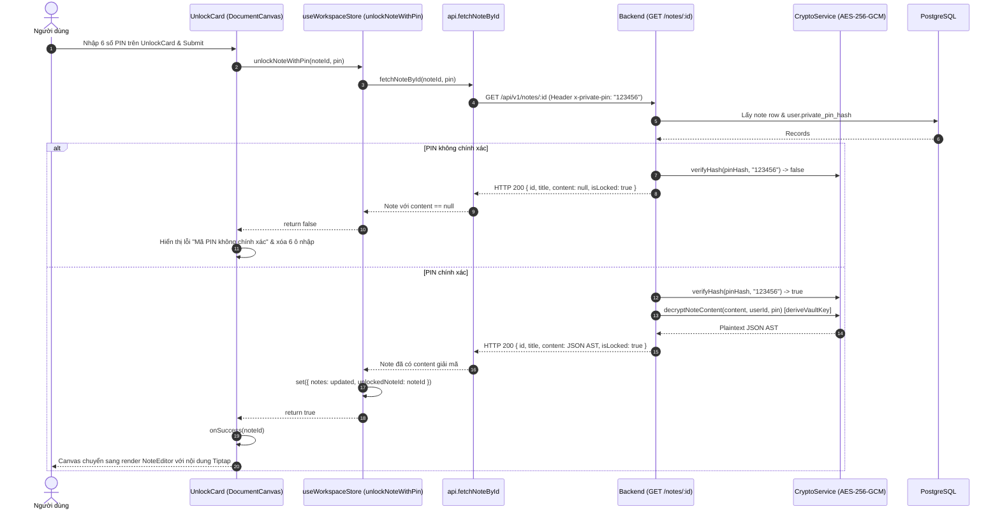

# Dataflow 05: Note Unlocking & Client-Side Decryption

## 1. Overview & Architectural Intent

Quy trình người dùng nhập mã Master PIN trực tiếp trên Canvas để giải mã và hiển thị một ghi chú đang bị khóa bảo mật:

- **Thẻ nhập PIN nhúng trực tiếp (`UnlockCard`)**: Xuất hiện ngay trên Canvas thay cho trình soạn thảo khi `note.isLocked && !isUnlockedLocally`.
- **Xác thực Header bí mật**: Client truyền PIN qua header `x-private-pin: <pin>` tới endpoint `GET /api/v1/notes/:id`.
- **Giải mã có điều kiện**: Backend chỉ giải mã khi mã PIN khớp với `private_pin_hash`. Nếu sai, Backend trả về `content: null`.
- **Isolated State Keying**: Thẻ `UnlockCard` được gắn `key={note.id}` giúp tự động reset 6 ô nhập PIN khi người dùng chuyển giữa các ghi chú khác nhau mà không gây re-render thừa.

---

## 2. Sequence Diagram



---

## 3. Data Transformation & Key Isolation

```
[Request từ Client]
GET /api/v1/notes/a9b8...
Headers:
  Authorization: Bearer <jwt>
  x-private-pin: 123456

         │
         ▼  (Backend: note.controller.ts)
1. verifyHash(user.private_pin_hash, "123456") ➔ TRUE
2. key = deriveVaultKey(userId, "123456")
3. decryptPayload(payload, key) ➔ Plaintext JSON AST
         │
         ▼
[Response về Client]
{
  "success": true,
  "data": {
    "id": "a9b8...",
    "title": "Kế hoạch tài chính 2026",
    "content": "{\"type\":\"doc\",\"content\":[...]}",
    "isLocked": true
  }
}
```

---

## 4. Defense-in-Depth & Error Edge Cases

1. **Không rò rỉ khi PIN sai**: Nếu mã PIN sai dù chỉ 1 ký tự, server trả về `content: null`. Client không nhận được bất kỳ ciphertext hay mảnh dữ liệu nào.
2. **Khóa cục bộ theo từng Note**: Biến `unlockedNoteId === note.id` đảm bảo việc mở khóa 1 note không làm mở khóa nhầm các note riêng tư khác trong cùng phiên làm việc.
3. **Reset khi chuyển trang**: Thuộc tính `key={note.id}` trên thẻ `UnlockCard` đảm bảo component unmount/remount sạch sẽ, xóa sạch mã PIN cũ khỏi ô nhập.
