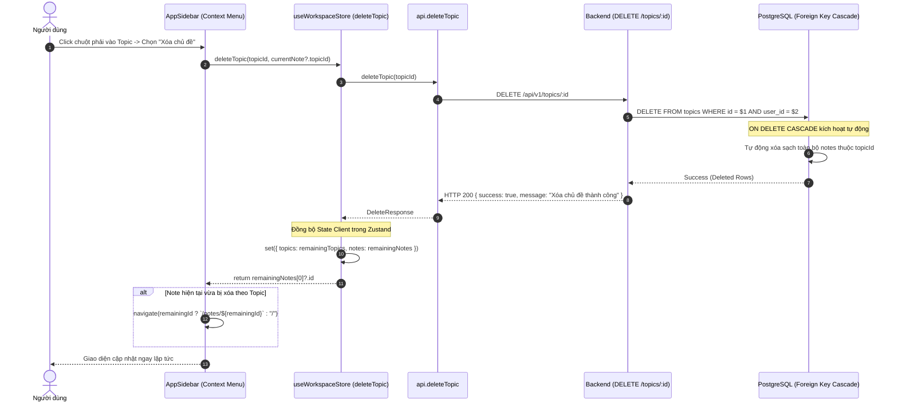

# Dataflow 06: Note & Topic Cascade Deletion with State Sync

## 1. Overview & Architectural Intent

Quy trình xóa tài liệu và xóa chủ đề trong NoteVault, đảm bảo tính toàn vẹn dữ liệu quan hệ và trải nghiệm người dùng mượt mà:

- **Xóa ghi chú đơn lẻ**: Xóa record khỏi bảng `notes`, đồng thời cập nhật state danh sách và điều hướng URL thông minh (fallback về note đầu tiên còn lại hoặc trang chủ `/`).
- **Xóa chủ đề liên đới (Cascade Delete)**:
  - Ở tầng Database: Foreign Key `Note.topic` định nghĩa `onDelete: Cascade` trong `contract.prisma` và `schema.prisma`.
  - Khi xóa một Topic, PostgreSQL tự động dọn sạch toàn bộ các ghi chú con thuộc chủ đề đó.
- **Xác nhận an toàn (Confirm Modal)**: Ngăn chặn thao tác xóa nhầm thông qua hộp thoại `ConfirmDeleteDialog`.

---

## 2. Sequence Diagram



---

## 3. Database Schema Relation (Cascade Constraint)

```prisma
model Topic {
  id        String   @id @default(uuid()) @db.Uuid
  userId    String   @map("user_id") @db.Uuid
  name      String   @db.VarChar(100)
  slug      String   @db.VarChar(100)
  // ...
  notes     Note[]

  user      User     @relation(fields: [userId], references: [id], onDelete: Cascade)
  @@map("topics")
}

model Note {
  id        String   @id @default(uuid()) @db.Uuid
  userId    String   @map("user_id") @db.Uuid
  topicId   String?  @map("topic_id") @db.Uuid
  // ...
  user      User     @relation(fields: [userId], references: [id], onDelete: Cascade)
  topic     Topic?   @relation(fields: [topicId], references: [id], onDelete: Cascade)
  @@map("notes")
}
```

---

## 4. Defense-in-Depth & Error Edge Cases

1. **User Isolation**: Câu lệnh `DELETE` luôn đi kèm điều kiện `user_id = $2` để ngăn chặn việc một người dùng gửi ID của chủ đề thuộc tài khoản khác nhằm xóa trộm.
2. **Không còn dữ liệu mồ côi (No Orphan Notes)**: Ràng buộc `onDelete: Cascade` ở mức Database Engine đảm bảo không bao giờ để lại các ghi chú có `topic_id` trỏ vào một chủ đề không còn tồn tại.
3. **Seamless Navigation**: Khi xóa ghi chú đang mở, hệ thống tự động chuyển vùng xem sang ghi chú kế tiếp hoặc canvas rỗng mà không gây lỗi 404.
