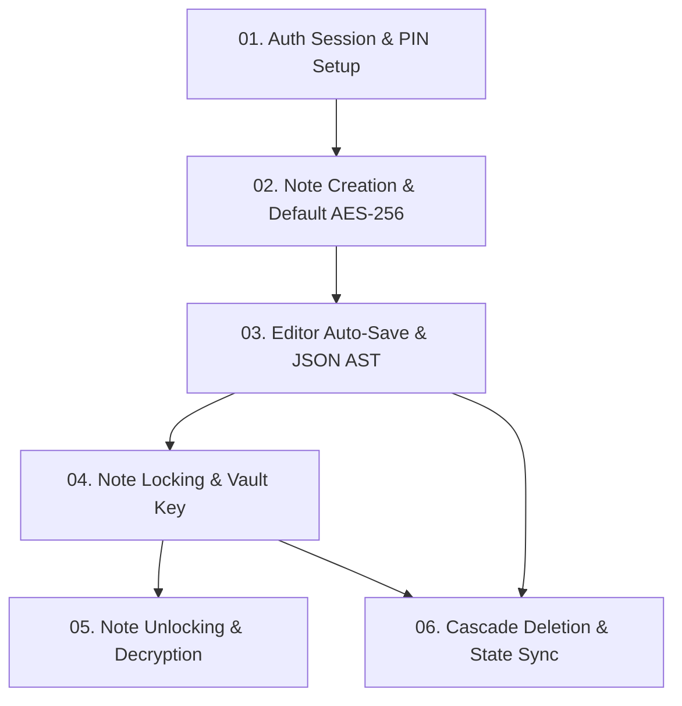

# NoteVault: End-to-End System Dataflows

Tập hợp 6 tài liệu Dataflow chuẩn kỹ thuật mô tả chi tiết đường đi của dữ liệu, quy trình biến đổi mã hóa và trạng thái giao diện trong NoteVault:

---

## Danh mục tài liệu Dataflow

| Mã     | Tài liệu Dataflow                                                                            | Phạm vi nghiệp vụ                                        | Mô hình bảo mật / Mật mã                    |
| :----- | :------------------------------------------------------------------------------------------- | :------------------------------------------------------- | :------------------------------------------ |
| **01** | [`01-auth-session-and-pin-setup.md`](./01-auth-session-and-pin-setup.md)                     | Đăng nhập tài khoản, cấp phát JWT & thiết lập Master PIN | `Argon2id` (Password & PIN hashing)         |
| **02** | [`02-note-creation-and-default-encryption.md`](./02-note-creation-and-default-encryption.md) | Khởi tạo ghi chú mới & lưu trữ mặc định                  | `AES-256-GCM` với `deriveUserKey`           |
| **03** | [`03-editor-autosave-and-json-ast.md`](./03-editor-autosave-and-json-ast.md)                 | Soạn thảo Tiptap, Debounce 800ms & đồng bộ AST           | ProseMirror JSON AST (Chống XSS)            |
| **04** | [`04-note-locking-and-vault-reencryption.md`](./04-note-locking-and-vault-reencryption.md)   | Khóa bảo vệ ghi chú bằng mã PIN                          | Mã hóa lại với `deriveVaultKey` & Purge RAM |
| **05** | [`05-note-unlocking-and-decryption.md`](./05-note-unlocking-and-decryption.md)               | Nhập PIN mở khóa tài liệu trực tiếp trên Canvas          | `x-private-pin` header & Decryption         |
| **06** | [`06-cascade-deletion-and-state-sync.md`](./06-cascade-deletion-and-state-sync.md)           | Xóa ghi chú đơn & Xóa chủ đề liên đới                    | PostgreSQL `ON DELETE CASCADE`              |
